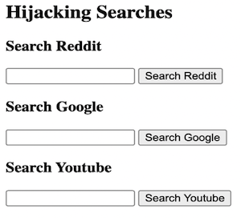

# Search It Up! 🔎

This project “hijacks” and bundles the search bars of Google, Reddit, Youtube, Wikipedia, and wikiHow, allowing users to search for content based on their website of choice and arrive directly at the desired search result page.

## 🎉 Demo 

## ✨ Motivation 

I built this project to solidify my understanding of the “action” attribute of form element as well as the “name” attribute of input element. Here’s a recap: when we submit a form to a server, the submission sends an HTTP request to the form “action”. The request includes data from form that’s packaged as a series of name-value pairs. The “name” attribute serves as the name in the pair, and the value is whatever the users pass into it. Without the “name” attribute, an <input> element cannot provide its value to the server on form submission.

## 👏 Credits

This project is based on the HTML tutorial by Colt Steele. Below is the original version:

